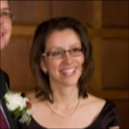
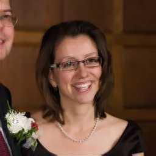
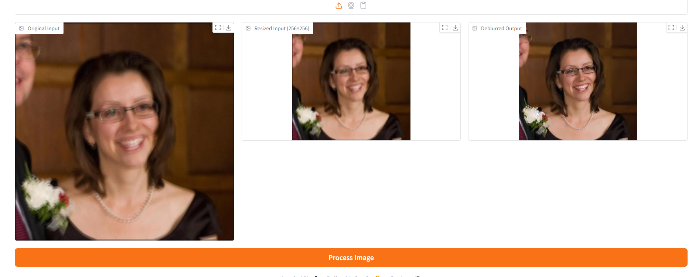

# Deblur GAN Demo ✨🖼️

This Space demonstrates a GAN-based image deblurring model using Gradio and TensorFlow.

---

## 🔧 How It Works
- Upload a blurry image — it will be automatically resized to **256×256**.
- The model will predict a **sharpened version** using your trained Deblur GAN.

---

## 📸 Example Input vs Output

| Blurry Input | Deblurred Output |
|--------------|------------------|
|  |  |

---

## Gradio Setup
## 📸 Example Input vs Output

| UI Gradio  |
|--------------|
|  |

## 🧠 Model Info

- **Architecture**: Custom U-Net style Deblur GAN x Res-Net Bottleneck 
- **loss**: LSGAN for Stable training,Perceptual_loss,SSIM,Psnr,Feature_loss from D
- **Training Settings**: Inst Norm,PatchGAN,TTUR,Beta_1 for Adam=0.0,MultiScale (D1,D2,D3)
- **Framework**: TensorFlow 2.x  
- **Trained on**: GoPro, CelebA, and TextOCR,Helen blur datasets  
- **Train time**: ~5 hours and 30 minutes on T4 GPU

---

## 🚀 Try It Yourself

Just upload a blurry image using the Gradio UI — inference is real-time.

---

## 📦 Requirements

To run this project locally or on Spaces, install the following Python packages:

```bash
pip install -r requirements.txt

